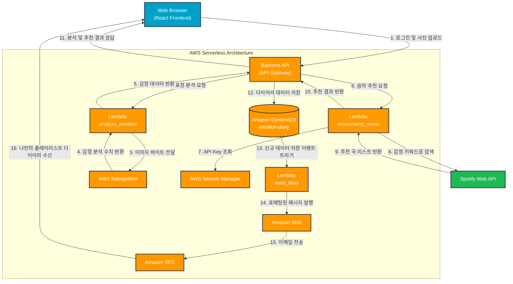

# AI 표정 분석 기반 맞춤형 음악 추천 및 서버리스 다이어리 전송 서비스

## A. 프로젝트 명 
**AI 표정 분석 기반 맞춤형 음악 추천 및 서버리스 다이어리 전송 서비스** 

## B. 프로젝트 멤버 이름 및 멤버 별 담당한 파트 소개 
* **고영림**: 백엔드 API 개발 담당 (클라이언트-서버 간 데이터 통신, API 엔드포인트 설계 및 핵심 비즈니스 로직 구현) 
* **윤혜진**: AWS Lambda 함수 개발 및 서버리스(Serverless) 인프라 구축 담당 (AWS SAM을 이용한 IaC 구성, 클라우드 리소스 권한 및 파이프라인 관리) 
* **안지원**: 프론트엔드 개발 담당 (React 기반 UI/UX 구현, 웹캠/사진 업로드 인터페이스 및 캘린더 다이어리 뷰어 컴포넌트 개발) 

## C. 프로젝트 소개 
본 프로젝트는 사용자가 웹 서비스에 로그인하여 자신의 얼굴이 담긴 사진을 업로드하면, AI가 얼굴의 표정을 분석하여 현재의 감정 상태를 파악하고 그에 맞는 음악을 추천해주는 **사용자 맞춤형 스마트 다이어리 서비스**입니다. 분석된 감정 데이터와 추천된 플레이리스트는 다이어리 형태로 기록되며, 서버리스 이벤트 트리거를 통해 사용자에게 알림 및 이메일로 전송되어 하루의 감정을 되돌아볼 수 있도록 돕습니다.

## D. 프로젝트 필요성 소개 
1. **개인화된 감정 맞춤형 콘텐츠 수요 충족**: 사용자의 번거로운 텍스트 입력 없이 사진 한 장만으로 즉각적인 감정 상태를 인지하고, 이에 최적화된 음악 플레이리스트 추천을 제공하여 긍정적인 사용자 경험을 창출합니다. 
2. **비동기식 서버리스 아키텍처 실무 도입**: 트래픽 변동에 유연하게 대응하고 유지보수 비용을 줄이기 위해 완전 관리형 서비스(AWS Lambda, DynamoDB) 기반의 서버리스 아키텍처를 도입하여 비용 효율성과 시스템 안정성을 구축했습니다. 
3. **다양한 클라우드 서비스 및 외부 API 연동**: AWS의 AI/ML 서비스(Rekognition)와 서드파티 서비스(Spotify)를 성공적으로 통합하는 데이터 파이프라인을 구축했습니다. 

## E. 관련 기술/논문/특허 조사 내용 소개 
* **클라우드 및 백엔드 (Serverless Architecture)**: 
* AWS Lambda, DynamoDB - 상태 전이 검증 및 다이어리 데이터 저장 
* AWS Rekognition - 이미지 기반 얼굴 표정 및 감정 AI 분석
* AWS SNS & SES - 구독 기반 알림 퍼블리싱 및 이메일 자동 생성/포매팅 
* AWS Secrets Manager - Spotify API Key 등 중요 환경변수 보호 
* AWS SAM - Serverless Application Model, `template.yaml` 활용 
* **프론트엔드**: React.js (컴포넌트 기반 아키텍처: `Calendar`, `SidePanel`, `UploadModal` 등) 
* **외부 API**: Spotify Recommendation API - 감정 메타데이터 기반 음악 큐레이션 
* **테스트**: Python `unittest` 및 `boto3` mocking 기반의 TDD - AWS 크레딧 소모 없는 로컬 격리 테스트 

## F. 프로젝트 개발 결과물 소개 
### 주요 서비스 워크플로우 
1. **인증 및 세션 관리**: 사용자가 사이트에 가입하고 로그인합니다. - 익명 세션 기능도 지원
2. **사진 업로드 및 검증**: 사용자가 `UploadModal`을 통해 셀카 이미지를 업로드하면 파일 무결성을 우선 검증합니다. 
3. **AI 표정 분석 (Rekognition)**: AWS Rekognition이 이미지를 분석해 '행복', '슬픔', '놀람' 등의 지배적인 감정을 추출합니다. 
4. **음악 추천 (Spotify)**: 도출된 감정 키워드를 바탕으로 Secrets Manager를 통해 안전하게 관리되는 인증키를 사용, Spotify API에서 맞춤형 트랙 리스트를 가져옵니다. 
5. **다이어리 저장 및 상태 전이**: 이미지 주소, 감정 분석 결과, 추천 음악 리스트가 DynamoDB에 저장되며 월별 다이어리로 리스트업됩니다. 
6. **결과 알림 (SNS/SES)**: 성공적으로 다이어리가 생성되면, SNS를 통해 이벤트가 발행되고 SES를 거쳐 포매팅된 이메일과 알림이 사용자에게 전송됩니다.

## G. 개발 결과물을 사용하는 방법 소개 (설치 방법, 동작 방법 등) 
> **참고:** 본 프로젝트는 크게 React 프론트엔드와 AWS SAM 기반 백엔드로 구성되어 있습니다. 
### 1. 프론트엔드 실행 방법 웹캠 및 사진 업로드 UI, 캘린더 컴포넌트를 확인하기 위해 로컬 개발 서버를 실행합니다. 
```bash 
# 레포지토리 클론 
git clone https://github.com/haerongnim/2026-Cloud-Computing-Project.git 
# 프론트엔드 디렉토리 이동 및 패키지 설치 
cd 2026-Cloud-Computing-Project/src npm install 
# 로컬 서버 실행 (보통 http://localhost:3000 에서 열림) 
npm start 
``` 
### 2. 백엔드 (AWS Serverless) 배포 방법 
AWS CLI 및 AWS SAM CLI가 설치되어 있고, 적절한 IAM 권한이 설정되어 있어야 합니다. 

```bash 
# 백엔드 인프라 디렉토리 이동 
cd ../infra-was/infra 
# SAM 빌드 (의존성 설치 및 패키징) 
sam build 
# AWS 클라우드에 배포 (안내에 따라 파라미터 입력) 
sam deploy --guided 
```
### 3. 로컬 테스트 실행 방법 (Python unittest)
AWS 서비스(DynamoDB, Rekognition, SNS 등)를 `boto3` 모킹을 통해 실제 과금 없이 로컬 환경에서 테스트할 수 있습니다. 
```bash 
# 테스트 디렉토리 이동 
cd ../tests 
# 전체 단위 테스트 실행 
python -m unittest discover 
``` 
## H. 개발 결과물의 활용방안 소개 
1. **멘탈 헬스케어 및 심리 상담 보조 도구**: 사용자의 일일 감정 변화를 다이어리 및 캘린더 형태로 시각화하여, 사용자 본인의 감정 기복을 눈으로 확인할 수 있으며, 심리 상담 혹은 진료 시에 보조 데이터로 활용할 수 있습니다. 
2. **맞춤형 디지털 마케팅 연계**: 표정 분석 데이터를 기반으로 음악뿐만 아니라, 사용자의 기분에 맞는 다른 콘텐츠를 큐레이션하는 상용 서비스로 도메인을 확장할 수 있습니다. 
3. **서버리스(Serverless) 파이프라인 레퍼런스**: AWS SAM, Lambda, DynamoDB 및 외부 API(Spotify)를 연동한 이벤트 주도형 아키텍처로서, 향후 유사한 클라우드 웹 애플리케이션 구축 시 템플릿으로 재활용할 수 있습니다. 

## I. AI 활용 
본 프로젝트는 팀원들이 직접 개발하였으나, 개발 생산성 향상과 인프라 권한 설정 등을 위해 부분적으로 AI 도구를 활용하였습니다. (단순 IDE 자동완성 및 공식 템플릿 코드는 제외하였습니다.) 
* **전체 프로젝트 중 AI 개발 비중**: 약 **20~25%** 
* **세부 AI 활용 내역**:
  
**1. AWS 리소스 최소 권한(Policy) 설정** 
* **적용 범위**: `infra-was/infra/template.yaml` 파일 내 Policies 영역 (나머지 인프라 코드는 직접 작성) 
* **사용 AI**: Claude Sonnet 4.6 (thinking) - Antigravity 사용 
* **프롬프트 내용**: *"Based on the project description and current structure, ensure that each resource has only the minimum necessary permissions"* 

**2. 프론트엔드 API 경로 수정 및 연동** 
* **적용 범위**: `src/api.js` 파일(직접 작성)을 기반으로 한 `src/components/Calendar.jsx` (6라인), `src/components/SidePanel.jsx` (5라인), `src/components/modals/UploadModal.jsx` (13라인) 등의 API 연동부 
* **사용 AI**: Claude Sonnet 4.6 (thinking) - Antigravity 사용 
* **프롬프트 내용**: *"Based on the newly created api.js file, modify the frontend accordingly. IMPORTANT:NEVER EVER CHANGE ANYTHING BESIDE FRONTEND CODE, propose changes first in .md format"* 

**3. 로컬 단위 테스트(Unit Test) 루틴 작성** 
* **적용 범위**: `tests` 디렉토리 내 로컬 테스트 코드 전체 
* **사용 AI**: Gemini 3.1 pro (high) - Antigravity 사용 
* **프롬프트 내용**: *"Based on current structure and project description, write Python unittest test suites. Requirements are as followed, 'Use only Python unittest (not pytest). Mock all AWS services (boto3, DynamoDB, Rekognition, SNS, SES, Secrets Manager). Do not require actual AWS credentials. Load Lambda handlers dynamically. Test should include happy paths, validation failures, duplicate requests, stale requests,idempotency, and other suggested aspects. Verify DynamoDB status transitions Verify Spotify recommendation workflow. Verify SNS publishing. Verify SES email generation. Verify email subject/body formatting. Verify authentication, signup, login, logout, and anonymous sessions. Verify upload validation and monthly diary listing.'"*

** 4. AWS Lambda 함수 코드 리팩토링 및 다듬기 **

* **적용 범위**: 백엔드 Lambda 함수 소스 코드 일부 (오류 처리, 가독성 및 성능 개선)

* **사용 AI**: Claude 3.5 Sonnet 
